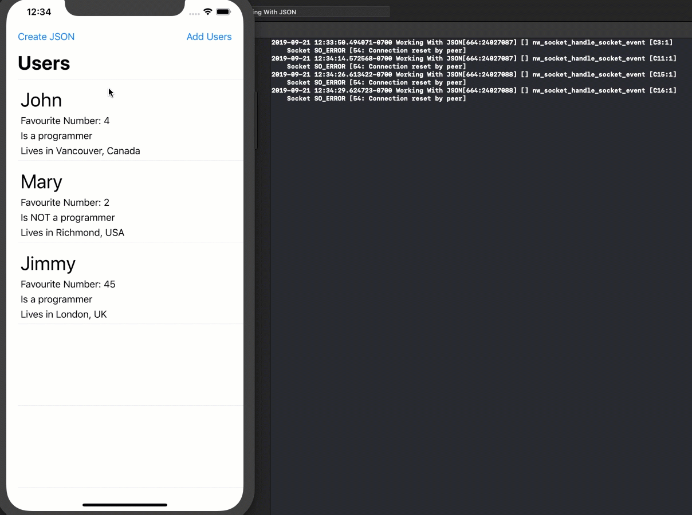

# Working-With-JSON

This is a simple example of how you can load JSON into an array of objects that are defined in the "Models.swift" file.  

The initial JSON data is stored in a json file within the main bundle of the project "SeedData.json"

The project allows you to update the data for the User and Family objects abd then give you the option to create new JSON.

The newly created JSON is printed to the console.

The reading (decoding) and creating (encoding) of the json is done through the two functions found in the "DataSource.swift" file


Here I show adding content to the Users and Family objects and generating new JSON that is displayed on the console.



Note:  Project is built using Xcode 11

### Data models

```swift
class User: Codable {
    let name:String
    let favouriteNumber: Int
    let isProgrammer: Bool
    let origin:Origin
    var family:[Family]
    
    func newFamilyMember(name:String, age:Int) {
        let newMember = Family(name: name, age: age)
        family.append(newMember)
    }
    
    internal init(name: String, favouriteNumber: Int, isProgrammer: Bool, origin: Origin, family: [Family]) {
        self.name = name
        self.favouriteNumber = favouriteNumber
        self.isProgrammer = isProgrammer
        self.origin = origin
        self.family = family
    }
}


struct Origin: Codable {
    let city:String
    let country:String
}

struct Family:Codable {
    let name:String
    let age: Int
}

```


### Seed JSON

```json
[  
   {  
      "name":"John",
      "favouriteNumber":4,
      "isProgrammer":true,
      "origin":{  
         "city":"Vancouver",
         "country":"Canada"
      },
      "family":[  
         {  
            "name":"Emily",
            "age":47
         },
         {  
            "name":"John",
            "age":18
         }
      ]
   },
   {  
      "name":"Mary",
      "favouriteNumber":2,
      "isProgrammer":false,
      "origin":{  
         "city":"Richmond",
         "country":"USA"
      },
      "family":[  
         {  
            "name":"Fred",
            "age":50
         },
         {  
            "name":"Jenny",
            "age":12
         },
         {  
            "name":"Albert",
            "age":2
         }
      ]
   },
      {  
      "name":"Jimmy",
      "favouriteNumber":45,
      "isProgrammer":true,
      "origin":{  
         "city":"London",
         "country":"UK"
      },
      "family":[  
         {  
            "name":"Terry",
            "age":16
         }
      ]
   }
]

```

### DataSource functions

The functions us generics so you can passs any object to decode and ecode.

```swift
enum DataSource {
    
    static func loadSeedData<T: Decodable>(_ type: T.Type, from file: String) -> T {
        guard let url = Bundle.main.url(forResource: file, withExtension: nil) else {
            fatalError("Could not find \(file)")
        }
        guard let data = try? Data(contentsOf: url) else {
            fatalError("Failed to load \(file) from bundle")
        }
        let decoder = JSONDecoder()
        guard let loaded = try? decoder.decode(T.self, from: data) else {
            fatalError("Failed to decode \(file) from bundle")
        }
        return loaded
    }
    
    static func createNewJSON<T: Encodable>(from data: T) -> String {
        let encoder = JSONEncoder()
        guard let newJSON = try? encoder.encode(data) else {
            fatalError("Could not encode data")
        }
        return String(data: newJSON, encoding: .utf8)!
    }
}
```


